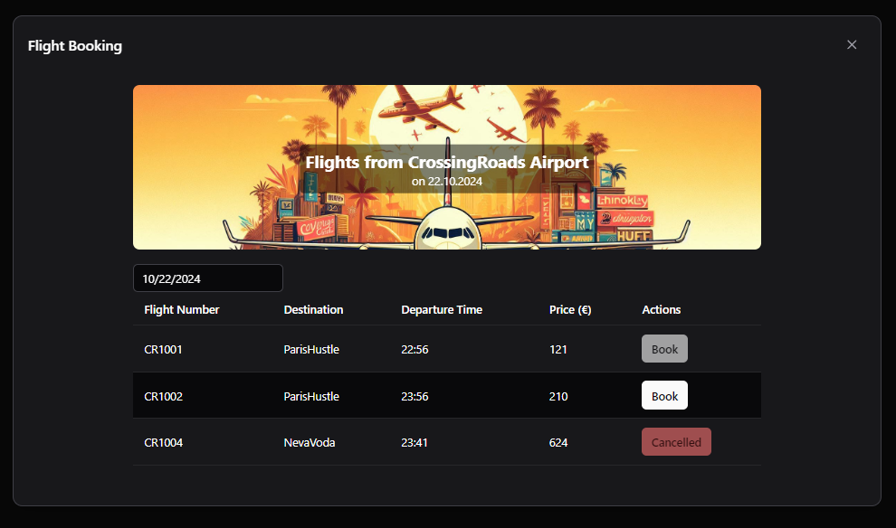

# Transfers

### Cross-Instance Character Transfer and Asset Shipping

Concept Overview: The Cross-Server Character Transfer and Asset Shipping System allows players to transfer their characters and in-game possessions between server instances, simulating realistic travel between different cities. Characters can move with their personal progress intact, while assets like money, vehicles, and inventory items are transferred using in-game services that mirror real-world logistics.

Key Features:
Character Transfer:
Players can move their characters to other servers, keeping their identity, skills, and progress, simulating travel between cities.

Money Transfer:
In-game banking services allow players to send money across servers for a fee, mimicking bank wire transfers.

Vehicle Shipping:
Vehicles can be shipped between servers using a freight or transportation service, with delivery taking in-game time.

Item Shipping:
Inventory items can be sent via an in-game postal service, where items are physically transported between servers and picked up at the destination.

Benefits:
This system keeps server economies stable while enhancing the roleplay experience by offering a realistic way to transport characters and assets across the game world.

THE TRANSFER IS ONLY FOR GP-Servers. If you are an server developer and have interest to also allow a transfer from and to your server then please open a ticket on discord.

Restrictions: You cannot transfer anything which is not existing on the target server. As example if a vehicle like BMW Z4 is not existing on target it is not possible to transfer it. 

## Character Transfer (Flight Booking)

To transfer a character between server instances, players can use the in-game flight booking system. This system simulates the process of booking a real-world flight, adding to the immersive experience. Here's how it works:

1. Access the flight booking interface at any in-game airport or travel agency.
2. Choose the destination server (city) from the available options.
3. Select a flight time from the available slots.
4. Review the transfer fees, which may vary based on destination and class of travel.
5. Confirm the booking and make the payment using in-game currency.
6. At the scheduled time, go to the airport and proceed to the boarding area.
7. Once at the boarding gate, the client will automatically disconnect.
8. Restart the game and connect to the destination server.
9. For the best travel experience, connect to the destination server at the scheduled arrival time.
10. Your character will land at the local airport of the new server along with all other players on the same flight.

Note: The transfer process is relatively quick, with no extended downtime. The main waiting period is between booking and the scheduled boarding time.

Remember to check any restrictions or requirements for character transfers before booking your flight. Some servers may have level requirements or other prerequisites for incoming transfers. 

It's crucial to note that your character name will remain the same across all server instances. To avoid conflicts, never create a new character on another instance with the same name as your existing character. If you encounter a naming conflict during transfer, you can open a ticket for assistance. However, we cannot guarantee resolution for all conflicting transfers, so it's best to maintain a unique character name across all instances.

