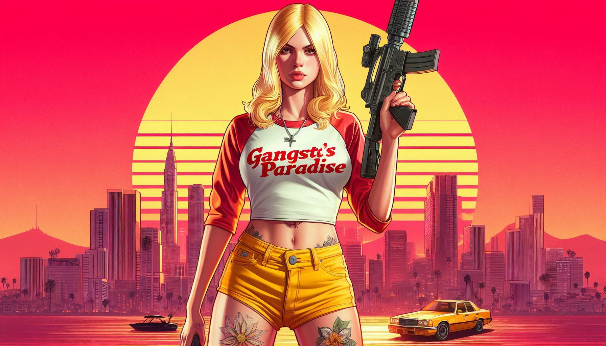

> **Note:** This page is currently a draft. Not all information presented here may be accurate or up-to-date. We're working on improving and finalizing the content. Thank you for your understanding.

# What is Gangsta's Paradise?

Gangsta's Paradise is a unique and immersive roleplaying experience that goes beyond the typical crime-focused gameplay. It's a platform where players can create and develop diverse characters in a realistic, player-driven world.

## Crossing Roads: The Multilingual GTA Roleplay Server

The first instance of Gangsta's Paradise is "Crossing Roads," a multilingual GTA Roleplay server. This server allows players from different linguistic backgrounds to interact and roleplay together, breaking down language barriers in the virtual world.

## Key Features:

1. **Realism-Focused:** Gangsta's Paradise emphasizes realistic interactions and consequences, creating a more immersive experience.

2. **Diverse Character Options:** Players are not limited to criminal roles. You can be a law-abiding citizen, a police officer, a business owner, or any other character you can imagine.

3. **Player-Driven World:** The in-game environment and economy are largely shaped by the players themselves. Your actions and decisions have a real impact on the world around you.

4. **Balance of Power:** While the name might suggest a criminal paradise, the server maintains a balance. Law enforcement and civilian roles are just as important and influential as criminal ones.

5. **Language-Specific Instances:** In addition to the multilingual Crossing Roads server, there are language-specific instances available for a more focused roleplay experience.

6. **Community Building:** Players have the opportunity to form organizations, businesses, and communities within the game, fostering a rich and dynamic social environment.

Remember, in Gangsta's Paradise, your experience is what you make of it. Whether you choose to walk the straight and narrow or live a life of crime, your choices and actions will shape your character's story and the world around you.

Do you have a general inquiry? Please feel free to contact us by creating a ticket in our Discord Server.

We ❤️ your feedback.

## History

The story of Gangsta's Paradise begins with a developer's journey into the world of roleplay servers. After years of professional experience in Java and .NET development, the creator's interest was piqued by GTA5 Roleplay servers.

The first virtual life experience on "StateV," a server initially running on RageMP before switching to AltV, sparked an idea: to create a unique server from scratch. This led to a period of experimentation with the FiveM platform, filled with numerous attempts and valuable lessons learned.

A significant breakthrough came with the discovery of the Athena framework. Years of dedicated work went into modifying and enhancing this core, resulting in the creation of the gp-core: Gangsta's Paradise Core system. This custom-built foundation, along with a multitude of plugins and enhancements, now powers the various instances of Gangsta's Paradise.

The development of Gangsta's Paradise has been a long and challenging journey, but one driven by passion and a vision for creating immersive, multilingual roleplaying experiences. As the project continues to evolve, the goal remains to grow it into a expansive platform and foster a vibrant, engaged community.

